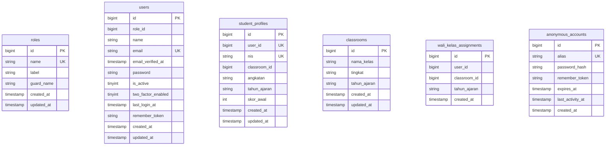
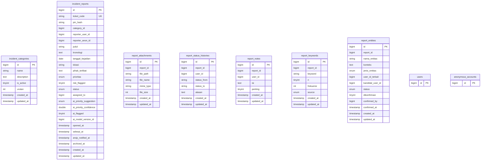
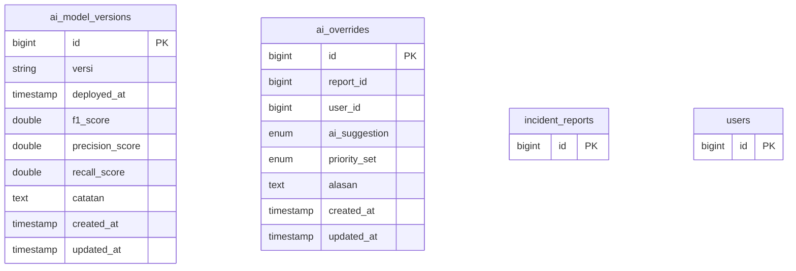
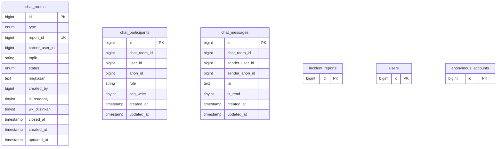
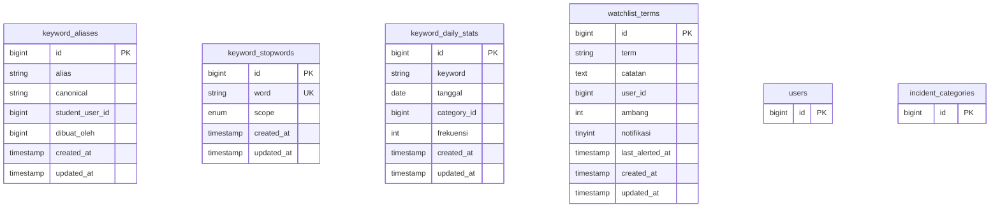
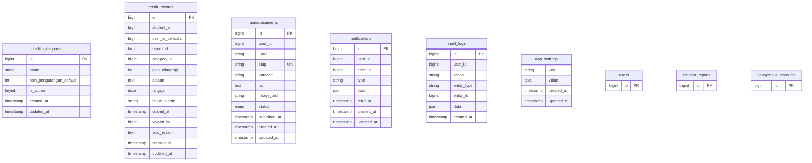

# ERD — Sistem Layanan Terpadu BK Sekolah

> Dihasilkan otomatis dari skema database (`php artisan docs:erd`) — 29 tabel aplikasi. Tabel bawaan framework (`cache`, `jobs`, `sessions`, dst.) tidak digambar.

Legenda: **PK** primary key · **FK** foreign key · **UK** unique. Relasi `||--o{` = satu-ke-banyak, `}o--o|` = banyak-ke-satu opsional.

## Gambaran menyeluruh (relasi, tanpa kolom)

## Domain 1 — Pengguna & Autentikasi

## Domain 2 — Laporan Insiden

## Domain 3 — AI Klasifikasi Prioritas

## Domain 4 — Chat

## Domain 5 — Analitik Kata Kunci

## Domain 6 — Skor Kredit, Konten & Sistem

## Kamus tabel

### `ai_model_versions`

| Kolom | Tipe | Kunci | Null |
|---|---|---|---|
| id | bigint | PK |  |
| versi | string |  |  |
| deployed_at | timestamp |  | ya |
| f1_score | double |  | ya |
| precision_score | double |  | ya |
| recall_score | double |  | ya |
| catatan | text |  | ya |
| created_at | timestamp |  | ya |
| updated_at | timestamp |  | ya |

### `ai_overrides`

| Kolom | Tipe | Kunci | Null |
|---|---|---|---|
| id | bigint | PK |  |
| report_id | bigint |  |  |
| user_id | bigint |  |  |
| ai_suggestion | enum |  | ya |
| priority_set | enum |  |  |
| alasan | text |  | ya |
| created_at | timestamp |  | ya |
| updated_at | timestamp |  | ya |

### `announcements`

| Kolom | Tipe | Kunci | Null |
|---|---|---|---|
| id | bigint | PK |  |
| user_id | bigint |  |  |
| judul | string |  |  |
| slug | string | UK |  |
| kategori | string |  |  |
| isi | text |  |  |
| image_path | string |  | ya |
| status | enum |  |  |
| published_at | timestamp |  | ya |
| created_at | timestamp |  | ya |
| updated_at | timestamp |  | ya |

### `anonymous_accounts`

| Kolom | Tipe | Kunci | Null |
|---|---|---|---|
| id | bigint | PK |  |
| alias | string | UK |  |
| password_hash | string |  |  |
| remember_token | string |  | ya |
| expires_at | timestamp |  |  |
| last_activity_at | timestamp |  | ya |
| created_at | timestamp |  | ya |

### `app_settings`

| Kolom | Tipe | Kunci | Null |
|---|---|---|---|
| key | string |  |  |
| value | text |  | ya |
| created_at | timestamp |  | ya |
| updated_at | timestamp |  | ya |

### `audit_logs`

| Kolom | Tipe | Kunci | Null |
|---|---|---|---|
| id | bigint | PK |  |
| user_id | bigint |  | ya |
| action | string |  |  |
| entity_type | string |  | ya |
| entity_id | bigint |  | ya |
| data | json |  | ya |
| created_at | timestamp |  | ya |

### `chat_messages`

| Kolom | Tipe | Kunci | Null |
|---|---|---|---|
| id | bigint | PK |  |
| chat_room_id | bigint |  |  |
| sender_user_id | bigint |  | ya |
| sender_anon_id | bigint |  | ya |
| isi | text |  |  |
| is_read | tinyint |  |  |
| created_at | timestamp |  | ya |
| updated_at | timestamp |  | ya |

### `chat_participants`

| Kolom | Tipe | Kunci | Null |
|---|---|---|---|
| id | bigint | PK |  |
| chat_room_id | bigint |  |  |
| user_id | bigint |  | ya |
| anon_id | bigint |  | ya |
| role | string |  |  |
| can_write | tinyint |  |  |
| created_at | timestamp |  | ya |
| updated_at | timestamp |  | ya |

### `chat_rooms`

| Kolom | Tipe | Kunci | Null |
|---|---|---|---|
| id | bigint | PK |  |
| type | enum |  |  |
| report_id | bigint | UK | ya |
| career_user_id | bigint |  | ya |
| topik | string |  | ya |
| status | enum |  |  |
| ringkasan | text |  | ya |
| created_by | bigint |  | ya |
| is_readonly | tinyint |  |  |
| wk_diizinkan | tinyint |  |  |
| closed_at | timestamp |  | ya |
| created_at | timestamp |  | ya |
| updated_at | timestamp |  | ya |

### `classrooms`

| Kolom | Tipe | Kunci | Null |
|---|---|---|---|
| id | bigint | PK |  |
| nama_kelas | string |  |  |
| tingkat | string |  |  |
| tahun_ajaran | string |  |  |
| created_at | timestamp |  | ya |
| updated_at | timestamp |  | ya |

### `credit_categories`

| Kolom | Tipe | Kunci | Null |
|---|---|---|---|
| id | bigint | PK |  |
| name | string |  |  |
| poin_pengurangan_default | int |  |  |
| is_active | tinyint |  |  |
| created_at | timestamp |  | ya |
| updated_at | timestamp |  | ya |

### `credit_records`

| Kolom | Tipe | Kunci | Null |
|---|---|---|---|
| id | bigint | PK |  |
| student_id | bigint |  |  |
| user_id_pencatat | bigint |  |  |
| report_id | bigint |  | ya |
| category_id | bigint |  |  |
| poin_dikurangi | int |  |  |
| alasan | text |  |  |
| tanggal | date |  | ya |
| tahun_ajaran | string |  |  |
| voided_at | timestamp |  | ya |
| voided_by | bigint |  | ya |
| void_reason | text |  | ya |
| created_at | timestamp |  | ya |
| updated_at | timestamp |  | ya |

### `incident_categories`

| Kolom | Tipe | Kunci | Null |
|---|---|---|---|
| id | bigint | PK |  |
| name | string |  |  |
| description | text |  | ya |
| is_active | tinyint |  |  |
| urutan | int |  |  |
| created_at | timestamp |  | ya |
| updated_at | timestamp |  | ya |

### `incident_reports`

| Kolom | Tipe | Kunci | Null |
|---|---|---|---|
| id | bigint | PK |  |
| ticket_code | string | UK |  |
| pin_hash | string |  | ya |
| category_id | bigint |  |  |
| reporter_user_id | bigint |  | ya |
| reporter_anon_id | bigint |  | ya |
| judul | string |  |  |
| kronologi | text |  |  |
| tanggal_kejadian | date |  | ya |
| lokasi | string |  | ya |
| pihak_terlibat | text |  | ya |
| prioritas | enum |  |  |
| risk_flagged | tinyint |  |  |
| status | enum |  |  |
| assigned_to | bigint |  | ya |
| ai_priority_suggestion | enum |  | ya |
| ai_priority_confidence | double |  | ya |
| ai_flagged | tinyint |  |  |
| ai_model_version_id | bigint |  | ya |
| opened_at | timestamp |  | ya |
| selesai_at | timestamp |  | ya |
| arsip_notified_at | timestamp |  | ya |
| archived_at | timestamp |  | ya |
| created_at | timestamp |  | ya |
| updated_at | timestamp |  | ya |

### `keyword_aliases`

| Kolom | Tipe | Kunci | Null |
|---|---|---|---|
| id | bigint | PK |  |
| alias | string |  |  |
| canonical | string |  |  |
| student_user_id | bigint |  | ya |
| dibuat_oleh | bigint |  | ya |
| created_at | timestamp |  | ya |
| updated_at | timestamp |  | ya |

### `keyword_daily_stats`

| Kolom | Tipe | Kunci | Null |
|---|---|---|---|
| id | bigint | PK |  |
| keyword | string |  |  |
| tanggal | date |  |  |
| category_id | bigint |  | ya |
| frekuensi | int |  |  |
| created_at | timestamp |  | ya |
| updated_at | timestamp |  | ya |

### `keyword_stopwords`

| Kolom | Tipe | Kunci | Null |
|---|---|---|---|
| id | bigint | PK |  |
| word | string | UK |  |
| scope | enum |  |  |
| created_at | timestamp |  | ya |
| updated_at | timestamp |  | ya |

### `notifications`

| Kolom | Tipe | Kunci | Null |
|---|---|---|---|
| id | bigint | PK |  |
| user_id | bigint |  | ya |
| anon_id | bigint |  | ya |
| type | string |  |  |
| data | json |  | ya |
| read_at | timestamp |  | ya |
| created_at | timestamp |  | ya |
| updated_at | timestamp |  | ya |

### `report_attachments`

| Kolom | Tipe | Kunci | Null |
|---|---|---|---|
| id | bigint | PK |  |
| report_id | bigint |  |  |
| file_path | string |  |  |
| file_name | string |  |  |
| mime_type | string |  | ya |
| file_size | int |  |  |
| created_at | timestamp |  | ya |
| updated_at | timestamp |  | ya |

### `report_entities`

| Kolom | Tipe | Kunci | Null |
|---|---|---|---|
| id | bigint | PK |  |
| report_id | bigint |  |  |
| nama_entitas | string |  |  |
| konteks | text |  | ya |
| jenis_entitas | enum |  | ya |
| user_id_terkait | bigint |  | ya |
| kandidat_user_id | bigint |  | ya |
| status | enum |  |  |
| dikonfirmasi | tinyint |  |  |
| confirmed_by | bigint |  | ya |
| confirmed_at | timestamp |  | ya |
| created_at | timestamp |  | ya |
| updated_at | timestamp |  | ya |

### `report_keywords`

| Kolom | Tipe | Kunci | Null |
|---|---|---|---|
| id | bigint | PK |  |
| report_id | bigint |  |  |
| keyword | string |  |  |
| n | tinyint |  |  |
| frekuensi | int |  |  |
| source | enum |  |  |
| created_at | timestamp |  | ya |
| updated_at | timestamp |  | ya |

### `report_notes`

| Kolom | Tipe | Kunci | Null |
|---|---|---|---|
| id | bigint | PK |  |
| report_id | bigint |  |  |
| user_id | bigint |  |  |
| isi | text |  |  |
| penting | tinyint |  |  |
| created_at | timestamp |  | ya |
| updated_at | timestamp |  | ya |

### `report_status_histories`

| Kolom | Tipe | Kunci | Null |
|---|---|---|---|
| id | bigint | PK |  |
| report_id | bigint |  |  |
| user_id | bigint |  | ya |
| status_from | string |  | ya |
| status_to | string |  |  |
| alasan | text |  | ya |
| created_at | timestamp |  | ya |
| updated_at | timestamp |  | ya |

### `role_permissions`

| Kolom | Tipe | Kunci | Null |
|---|---|---|---|
| id | bigint | PK |  |
| role | string |  |  |
| feature | string |  |  |
| value | string |  |  |
| created_at | timestamp |  | ya |
| updated_at | timestamp |  | ya |

### `roles`

| Kolom | Tipe | Kunci | Null |
|---|---|---|---|
| id | bigint | PK |  |
| name | string | UK |  |
| label | string |  |  |
| guard_name | string |  |  |
| created_at | timestamp |  | ya |
| updated_at | timestamp |  | ya |

### `student_profiles`

| Kolom | Tipe | Kunci | Null |
|---|---|---|---|
| id | bigint | PK |  |
| user_id | bigint | UK |  |
| nis | string | UK |  |
| classroom_id | bigint |  | ya |
| angkatan | string |  | ya |
| tahun_ajaran | string |  | ya |
| skor_awal | int |  |  |
| created_at | timestamp |  | ya |
| updated_at | timestamp |  | ya |

### `users`

| Kolom | Tipe | Kunci | Null |
|---|---|---|---|
| id | bigint | PK |  |
| role_id | bigint |  | ya |
| name | string |  |  |
| email | string | UK |  |
| email_verified_at | timestamp |  | ya |
| password | string |  |  |
| is_active | tinyint |  |  |
| two_factor_enabled | tinyint |  |  |
| last_login_at | timestamp |  | ya |
| remember_token | string |  | ya |
| created_at | timestamp |  | ya |
| updated_at | timestamp |  | ya |

### `wali_kelas_assignments`

| Kolom | Tipe | Kunci | Null |
|---|---|---|---|
| id | bigint | PK |  |
| user_id | bigint |  |  |
| classroom_id | bigint |  |  |
| tahun_ajaran | string |  |  |
| created_at | timestamp |  | ya |

### `watchlist_terms`

| Kolom | Tipe | Kunci | Null |
|---|---|---|---|
| id | bigint | PK |  |
| term | string |  |  |
| catatan | text |  | ya |
| user_id | bigint |  |  |
| ambang | int |  |  |
| notifikasi | tinyint |  |  |
| last_alerted_at | timestamp |  | ya |
| created_at | timestamp |  | ya |
| updated_at | timestamp |  | ya |

